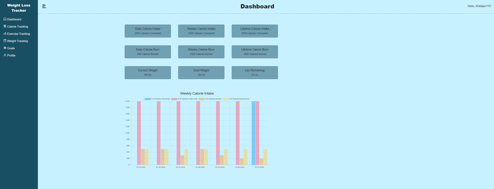
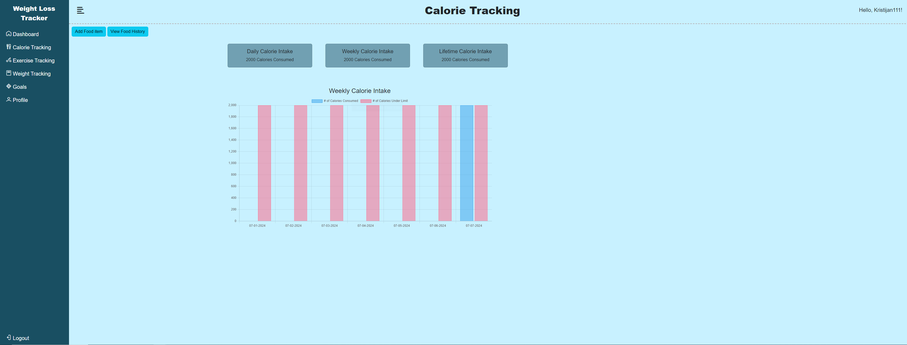
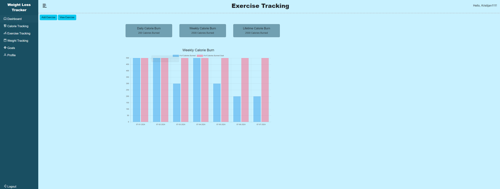
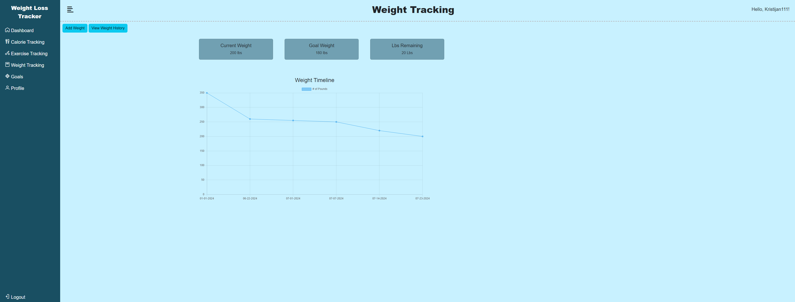
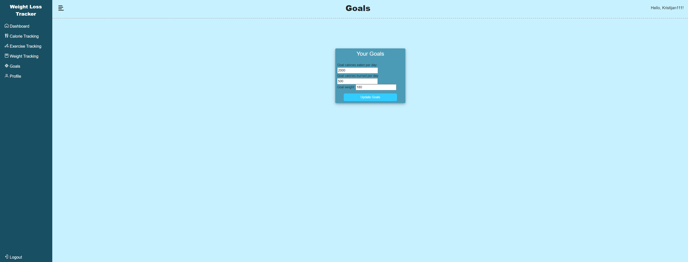
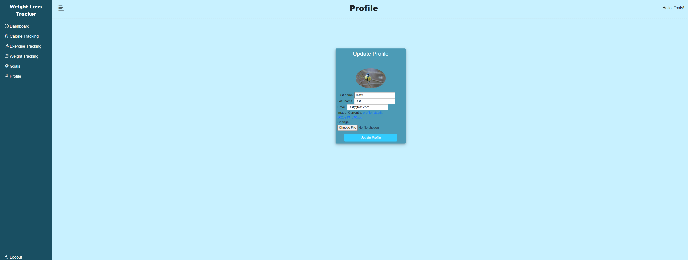
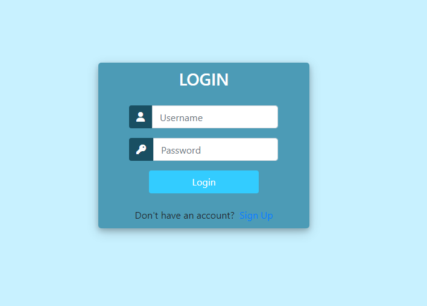
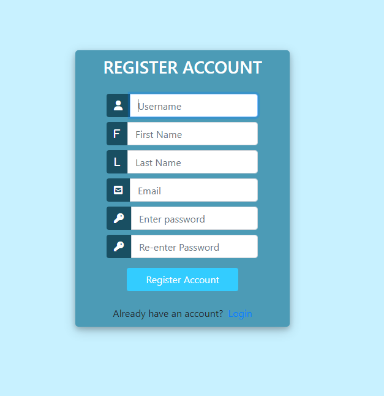
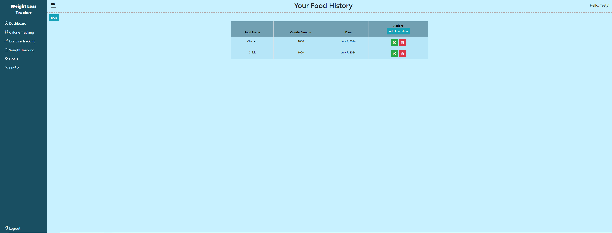
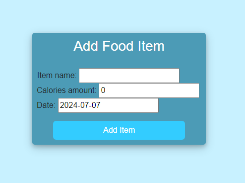

# Weight Loss Tracker WebApp created with Django
 Weight Loss tracker WebApp made with Django in python.
 
## Screenshots

**Dashboard**

**Calorie Tracking**

**Exercise Tracking**

**Weight Tracking**

**Goals**

**Profile**

**Login**

**Register**

**History**

**Add Item**

## Tech Stack

**Client:** Python, Django, Bootstrap, Sqlite3, HTML, CSS, Chart.js